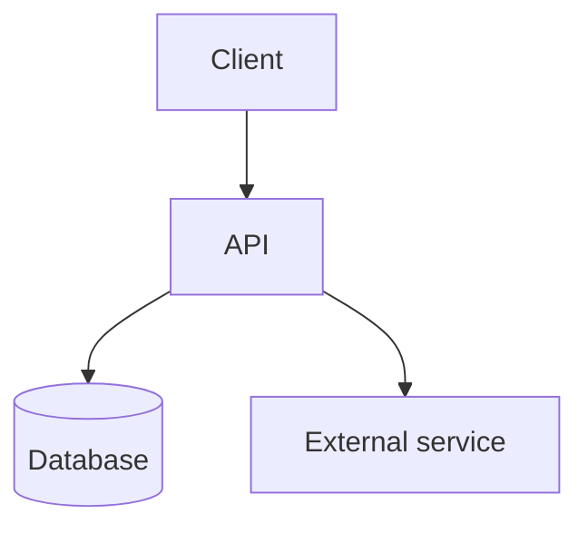

# Architecture — {{PROJECT_NAME}}

> Last updated: {{DATE}}
> Update when a component is added, removed, or changes responsibility — not for every file.

## System overview

<!-- What the system is made of and how a request moves through it.
     Trace one real user action end to end; that's what makes this concrete. -->

### Request flow

<!-- Example:
     1. User submits <input> in <component>
     2. <component> validates and calls <service>
     3. <service> calls <external API> with <payload>
     4. Result is <stored/returned> and rendered in <component>
-->

### Diagram

### External dependencies

| Service | Used for | Failure behaviour |
|---|---|---|
| | | |

## Component architecture

<!-- One section per component. -->

### <Component name>

- **Responsibility:** 
- **Interface:** 
- **Depends on:** 
- **Key decisions:** <the ones that would be annoying to reverse, and why they were made>

## Data model

<!-- Entities, fields that matter, relationships. Link to migrations if they exist. -->

## Cross-cutting concerns

- **Auth:** 
- **Secrets:** 
- **Error handling:** 
- **Logging / observability:** 
